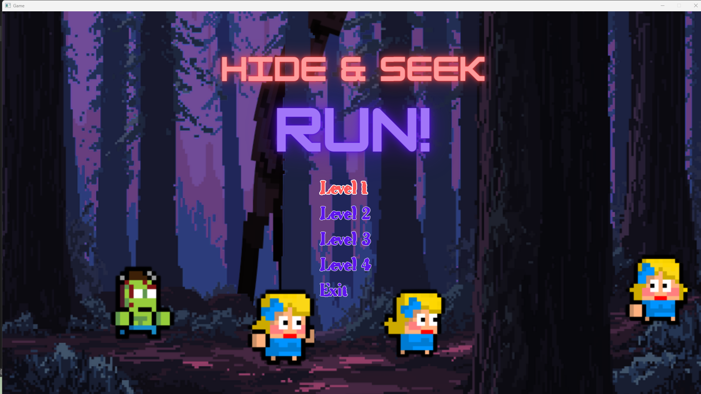
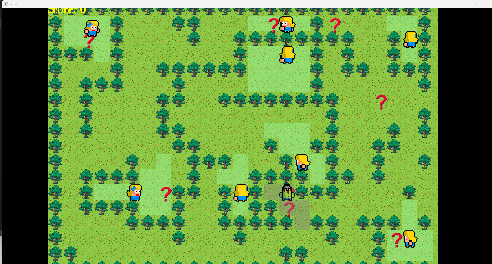

# Hide-and-seek Game

## Giới thiệu

Đây là dự án game "Hide-and-seek" (Trốn tìm) được phát triển bằng C++ sử dụng cấu trúc thư mục rõ ràng, hỗ trợ nhiều thuật toán AI như A* Search, BFS, Minimax. Game bao gồm nhiều màn chơi với bản đồ và menu lựa chọn.

## Cấu trúc thư mục

- **gamepong/**: Mã nguồn chính của game.
  - `AstarSearch.h`, `bfs_algorithm.h`, `minimax_algorithm.h`: Các thuật toán AI.
  - `figure.h`, `hider.h`, `seeker.h`, `sightrange.h`: Định nghĩa các đối tượng và logic game.
  - `Source.cpp`: Điểm vào chương trình.
  - **Assets/**: Tài nguyên game.
  - **Level/**: Các màn chơi và bản đồ.
    - `level.h`: Định nghĩa màn chơi.
    - **Level1_2/**, **Level3/**, **Level4/**: Thư mục màn chơi, mỗi màn có bản đồ riêng.
  - **Menu/**: Các thành phần menu.
    - `MenuEntry.h`, `MenuLevel*.h`, `WinLose.h`: Điều khiển giao diện menu.
- **include/**, **lib/**: Thư viện và header ngoài.

## Hướng dẫn build & chạy

1. Mở file `gamepong.sln` bằng Visual Studio.
2. Chọn cấu hình `Debug` hoặc `Release`.
3. Build và chạy dự án.

## Thuật toán sử dụng

- **A* Search**: Tìm đường đi tối ưu cho seeker/hider.
- **BFS**: Tìm kiếm theo chiều rộng.
- **Minimax**: Ra quyết định cho AI.

## Demo

